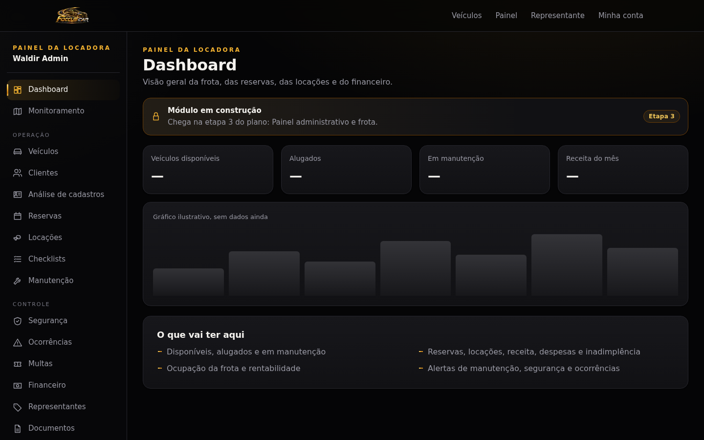
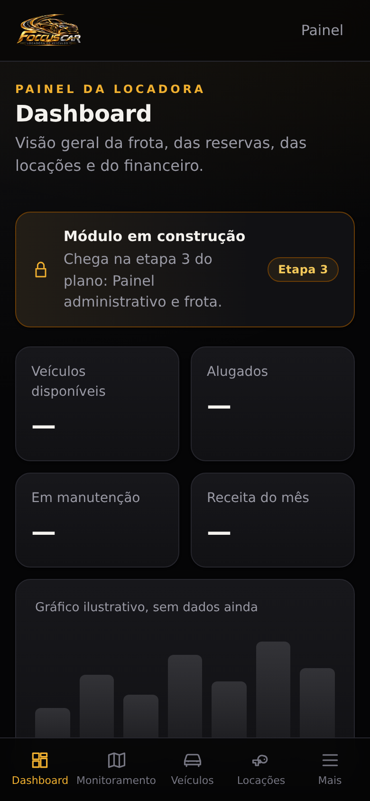
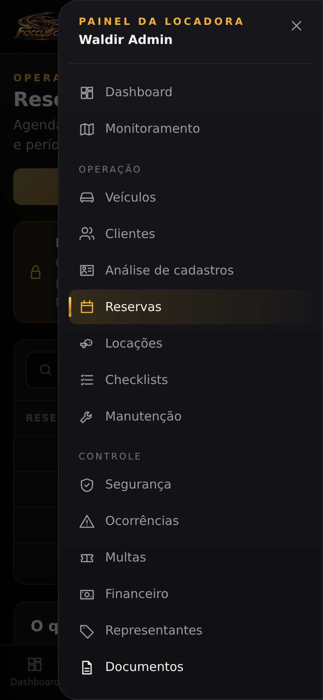
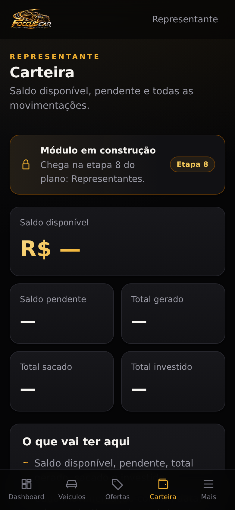
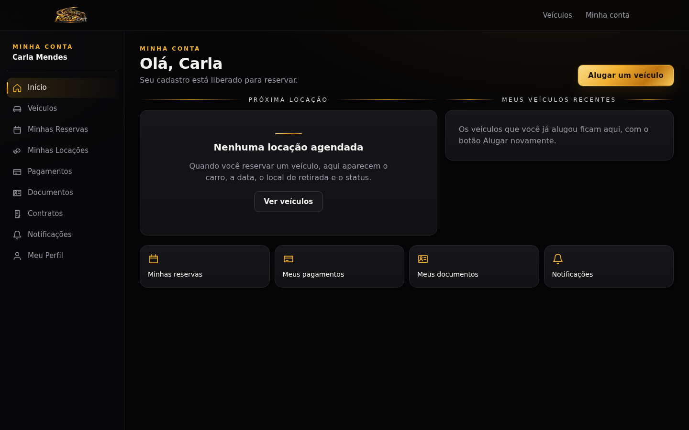
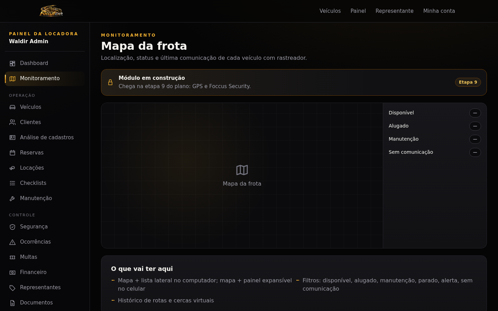

# Foccus Car — Layout e navegação

Mapa de todas as áreas do aplicativo (seções 8, 92, 93 e 94 da especificação). Rotas que ainda não têm módulo pronto mostram uma **tela-esqueleto**: o formato final da tela (indicadores, tabela, cartões, mapa ou lista), a etapa do plano que entrega o módulo e o que ela vai ter. Nenhuma tela fica vazia (seção 102).

## Estrutura responsiva

| Tela | Navegação |
|---|---|
| Celular (< 768 px) | Barra inferior com até 4 atalhos + botão **Mais**, que abre o menu completo em gaveta |
| Tablet (768–1099 px) | Menu lateral só com ícones (nome aparece ao passar o mouse e para leitores de tela) |
| Computador (≥ 1100 px) | Menu lateral completo, agrupado, com o nome da pessoa e atalho para as outras áreas |

Arquivos:

- `apps/web/src/lib/navigation.ts`: itens de menu das três áreas, com a permissão de cada item.
- `apps/web/src/components/shell/AreaLayout.tsx`: confere login e perfil **no servidor** antes de desenhar a área e entrega ao menu só os itens permitidos.
- `apps/web/src/components/shell/AppShell.tsx` e `shell.css`: menu lateral, barra inferior e gaveta.
- `apps/web/src/lib/modules.ts` e `components/shell/ModulePage.tsx`: catálogo das telas-esqueleto. Quando um módulo é implementado, a página passa a ter o próprio conteúdo e sai do catálogo.

Esconder um item do menu não é segurança: cada página e cada API continuam verificando permissão (seção 95).

## Áreas e rotas

### Público (sem login)

| Rota | Tela |
|---|---|
| `/` | Vitrine com filtros |
| `/veiculos/{id}` | Detalhes do veículo |
| `/entrar`, `/recuperar-senha`, `/redefinir-senha` | Login, criação de conta e senha |
| `/cadastro` | Cadastro completo do cliente (única área liberada antes do cadastro aprovado) |

### Cliente — `/conta` (seção 93)

Exige login e cadastro liberado; sem isso, a pessoa é levada ao `/cadastro` (seção 18).

| Menu | Rota | Etapa |
|---|---|---|
| Início | `/conta` | pronto (seção 91) |
| Veículos | `/` | pronto |
| Minhas Reservas | `/conta/reservas` | 4 |
| Minhas Locações | `/conta/locacoes` | 5 |
| Pagamentos | `/conta/pagamentos` | 4 |
| Documentos | `/conta/documentos` | documentos já ficam em `/cadastro` |
| Contratos | `/conta/contratos` | 4 |
| Notificações | `/conta/notificacoes` | 10 |
| Meu Perfil | `/cadastro` | pronto |

### Representante — `/representante` (seção 94)

Exige a permissão `representative:listings.manage`.

| Menu | Rota | Etapa |
|---|---|---|
| Dashboard | `/representante` | 8 |
| Veículos | `/representante/veiculos` | 8 |
| Minhas Ofertas | `/representante/ofertas` | 8 |
| Clientes | `/representante/clientes` | 8 |
| Reservas | `/representante/reservas` | 8 |
| Locações | `/representante/locacoes` | 8 |
| Ganhos | `/representante/ganhos` | 8 |
| Carteira | `/representante/carteira` | 8 |
| Saques | `/representante/saques` | 8 |
| Foccus Invest | `/representante/invest` | 8 (só com provedor regulado) |
| Perfil | `/representante/perfil` | 8 |

### Equipe da locadora — `/admin` (seção 92)

Exige perfil de equipe (administrador, gerente, operador ou financeiro). Cada item aparece só para quem tem a permissão.

| Menu | Rota | Permissão | Etapa |
|---|---|---|---|
| Dashboard | `/admin` | equipe | 3 |
| Monitoramento | `/admin/monitoramento` | `gps:view` | 9 |
| Veículos | `/admin/veiculos` | `vehicles:view` | 3 |
| Clientes | `/admin/clientes` | `customers:view` | — |
| Análise de cadastros | `/admin/cadastros` | `customers:documents.review` | pronto |
| Reservas | `/admin/reservas` | `reservations:view` | 4 |
| Locações | `/admin/locacoes` | `rentals:view` | 5 |
| Checklists | `/admin/checklists` | `checklists:execute` | 5 |
| Manutenção | `/admin/manutencao` | `maintenance:view` | 6 |
| Segurança | `/admin/seguranca` | `security:alerts.manage` | 9 |
| Ocorrências | `/admin/ocorrencias` | `occurrences:manage` | 6 |
| Multas | `/admin/multas` | `fines:manage` | 6 |
| Financeiro | `/admin/financeiro` | `finance:view` | 7 |
| Representantes | `/admin/representantes` | `representatives:manage` | 8 |
| Documentos | `/admin/documentos` | `vehicles:view` | 3 |
| Relatórios | `/admin/relatorios` | `reports:view` | 11 |
| Histórico | `/admin/historico` | `audit:view` | 3 |
| Usuários | `/admin/usuarios` | `users:view` | 3 |
| Configurações | `/admin/configuracoes` | `settings:manage` | — |

"Análise de cadastros" e "Representantes" não estão na lista da seção 92, mas precisam de lugar no menu: a primeira já existe (etapa 2) e a segunda é a gestão do programa das seções 64 a 67.

## Capturas

| | |
|---|---|
|  |  |
|  |  |
|  |  |
